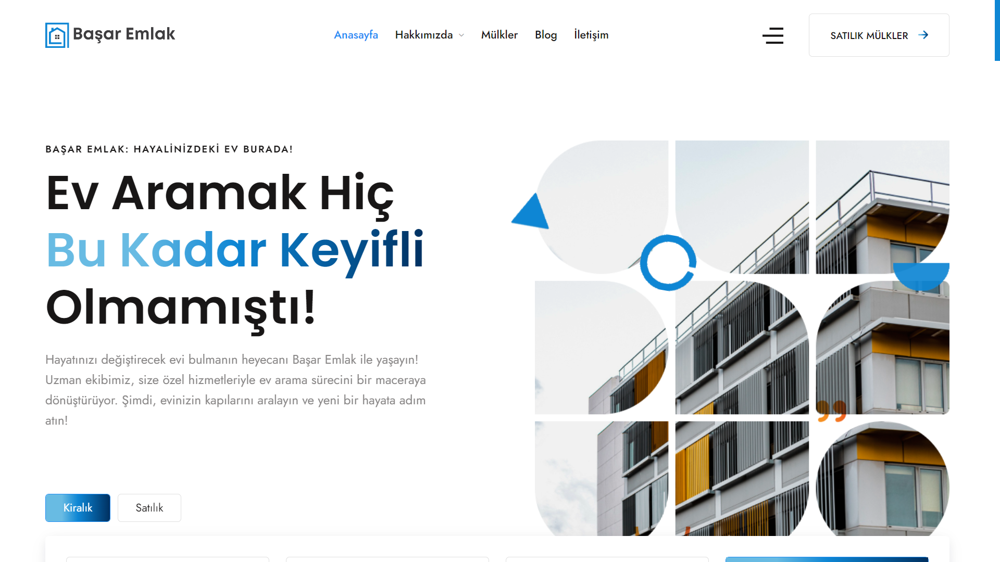
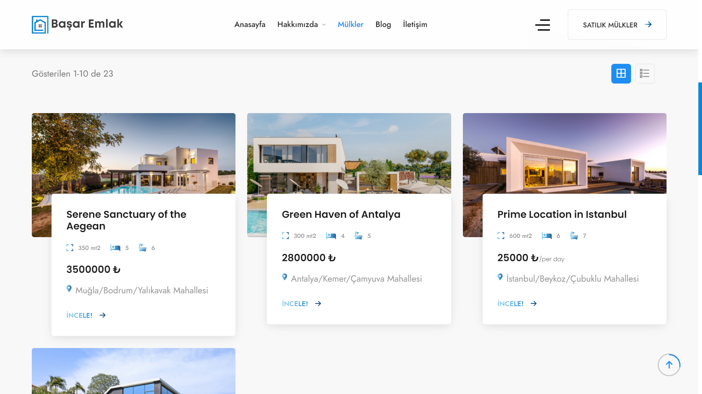
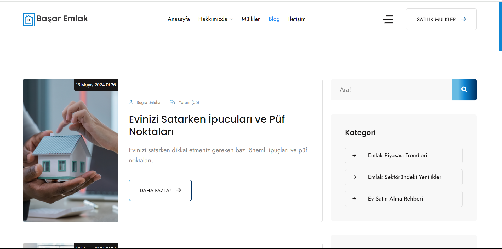
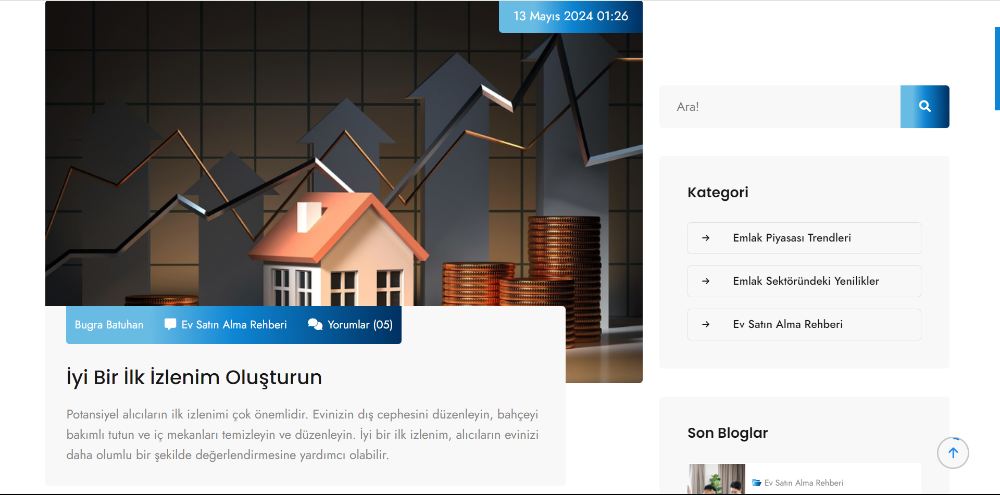
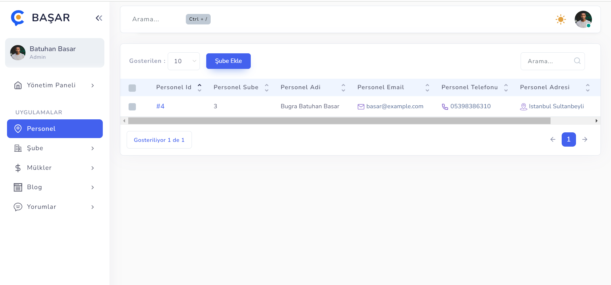
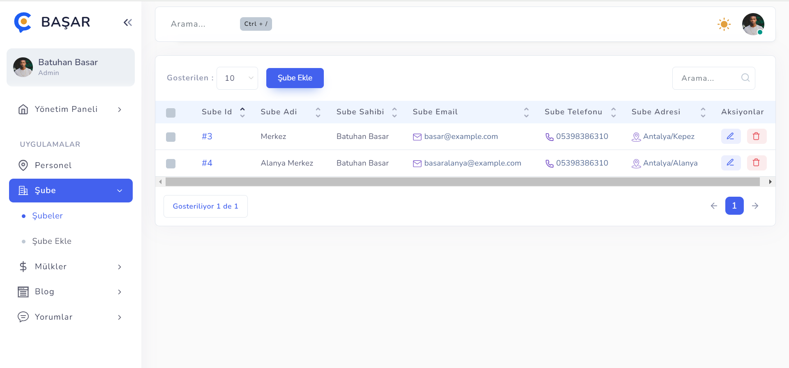

<h1 style="color:#27ae60;">🏡 Basar Emlak Web Sitesi</h1>

<strong style="color:#e74c3c;">Proje:</strong> Basar Emlak Web Sitesi

<strong style="color:#e74c3c;">Amaç:</strong> Kişisel gelişim ve web geliştirme becerilerini artırmak

<strong style="color:#e74c3c;">Kod Paylaşımı:</strong> Bu proje, GitHub'da açık kaynak olarak paylaşılmıştır.

<h2 style="color:#2ecc71;">Proje Özeti</h2>

Bu proje, Basar Emlak için modern, kullanıcı dostu ve dinamik bir web sitesi geliştirme üzerine odaklanmıştır. Web sitesi, firmanın emlak portföyünü sergilemek, kullanıcılarla etkileşime geçmek ve site içeriğini yönetim paneli aracılığıyla dinamik olarak kontrol etmek için tasarlanmıştır.

<h2 style="color:#2ecc71;">Öne Çıkan Özellikler</h2>
<ul>
    <li><strong style="color:#f39c12;">Emlak Portföyü:</strong> Satılık ve kiralık mülklerin detaylı bilgileri ve görselleri.</li>
    <li><strong style="color:#f39c12;">Kullanıcı Dostu Arayüz:</strong> Ziyaretçilerin kolayca bilgi bulabilmesi için basit ve etkili bir tasarım.</li>
    <li><strong style="color:#f39c12;">Duyarlı Tasarım:</strong> Mobil ve masaüstü cihazlarla uyumlu, esnek bir yapı.</li>
    <li><strong style="color:#f39c12;">Yönetim Paneli:</strong> Site içeriğinin dinamik olarak yönetilebilmesini sağlayan, kullanıcı dostu bir yönetim arayüzü.</li>
    <li><strong style="color:#f39c12;">İletişim Formu:</strong> Kullanıcıların hızlı ve kolayca iletişime geçebileceği bir form.</li>
</ul>

<h2 style="color:#2ecc71;">Yönetim Paneli Özellikleri</h2>
<ul>
    <li><strong style="color:#f39c12;">Şube Tanımlama:</strong> Emlak ofisi şubeleri tanımlanabilir ve bu şubelere özel personeller atanabilir.</li>
    <li><strong style="color:#f39c12;">Personel Yönetimi:</strong> Şube çalışanları tarafından mülk hakkında bilgiler eklenebilir ve düzenlenebilir.</li>
    <li><strong style="color:#f39c12;">Blog Yönetimi:</strong> Şube çalışanları blog postları ekleyip düzenleyebilir. Müşteriler dışarıdan yorum yapabilir ve bu yorumlar için onay sistemi mevcuttur.</li>
</ul>

<h2 style="color:#2ecc71;">Görseller</h2>

Web sitesinin ve yönetim panelinin bazı bölümlerine ait görseller aşağıda sunulmuştur:

<!-- Görsel 1 -->

<!-- Görsel 2 -->

<h2 style="color:#2ecc71;">Kod Paylaşımı</h2>

Bu proje, kendimi geliştirmek amacıyla yapılan bir çalışma olup, GitHub'da açık kaynak olarak paylaşılmıştır. Projenin kodlarına erişmek için <a href="https://github.com/bgrabatu/basar-emlak" target="_blank" style="color:#2980b9; text-decoration: none;">buraya tıklayın</a>.

<h2 style="color:#2ecc71;">İletişim</h2>

Bu projeyle ilgili detaylar veya geri bildirim için <a href="mailto:treebsoftware@gmail.com" style="color:#c0392b; text-decoration: none;">buradan</a> bana ulaşabilirsiniz.

<em>Bu proje, web geliştirme becerilerini artırmak için kişisel bir çalışma olarak tasarlanmıştır.</em>

